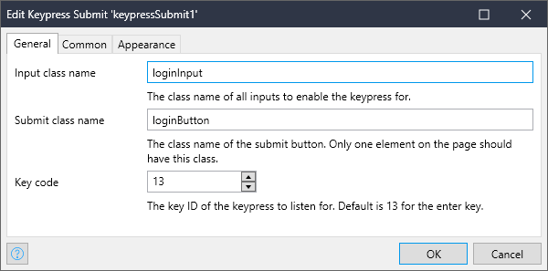

## KeypressSubmit

A very basic widget that adds keypress event listeners to inputs with a specified class, then automatically clicks the specified button when a key, such as enter, is pressed. Useful for making forms more easily submittable.

<picture>
  
</picture>

## Issues, suggestions and feature requests
https://github.com/kareesnc/KeypressSubmitWidget
